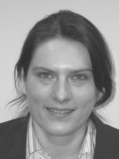

```{r setup, include=FALSE}
knitr::opts_chunk$set(echo = TRUE)
```

```{r comment, eval=FALSE, include=FALSE}
# need to fix the css lawout
```


Aside
================================================================================

{width=20%}

Contact {#contact}
--------------------------------------------------------------------------------


- <i class="far fa-address-book"></i> Gjøstigen 18. 1914 Ytre Enebakk
- <i class="fas fa-birthday-cake"></i> 27/07/76
- <i class="fa fa-envelope"></i> evezeyl@gmail.com
- <i class="fa fa-github"></i> github.com/evezeyl
- <i class="fa fa-linkedin"></i> [Profile](https://www.linkedin.com/public-profile/settings?trk=d_flagship3_profile_self_view_public_profile) 
- <i class="fa fa-researchgate"></i> [Profile](https://www.researchgate.net/profile/Eve_Zeyl_Fiskebeck)
- <i class="fa fa-phone"></i> +47 454 15 690


Language Skills {#skills}
--------------------------------------------------------------------------------


```{r skills_temporary, eval=FALSE, include=FALSE}
skills <- tribble(
  ~skill,               ~level,
  "R",                  4,
  "Python",             3,
  "Bash",               3,
  "SQL",                3,
)
build_skill_bars(skills)
```

Main
================================================================================

Eve Zeyl Fiskebeck {#title}
--------------------------------------------------------------------------------

In a nutshell: {#title}
--------------------------------------------------------------------------------

- I want to use molecular genetics analysis methods (phylogeny and phylogeography, transmission and GWAS) to study micro and macro evolution mechanisms in order to understand adaptation and adaptability potential of different organisms to provide a better understanding of their biology and in case of pathogens to improve detection and help informed decisions for control.
- I am interested in finding the best solutions to analyse data, understanding methods, combining methods, transposing methods between different scientific fields.
- My abilities are equally "practical" and "theoretical". I see and focus on methodologies which have practical application in the context of a current subject.
- I particularly thrives in a coworking environment where each person provides its own expertise and contribute as a piece of a jigsaw puzzle to create a complete picture of a scientific question.
- I am enthusiastic and likes to help others. I believe in exchange of competencies. I thrive with constant learning.
- I enjoy coding and improving my data science abilities (relaxing self-fulfilling activities).

Working experience: {#title}
--------------------------------------------------------------------------------

01/12/2018 to 30/11/2019 Reconversion to Bioinformatics. Trainee and 40% employment during 6 months on 2 projects. Veterinary Institute, Oslo, Norway

- Phylogenetics and phylogeography of *Yersinia ruckeri.*
- Phylogenetics of *Listeria monocytogenes*.

Tasks:

Exploration methods: Assembly, mapping, annotation, variants/SNP typing, dendrograms and phylogenetic trees (core and pangenome), phylogeography and transmission methods. GWAS.

Scripting: R (mainly), bash, python

[Contribution to intern course](https://github.com/NorwegianVeterinaryInstitute/BioinfTraining): Conda, Poppunk, HPC, mapping, tree building ...

Reference:  Karin Lagesen: [karin.lagesen@vetinst.no](mailto:karin.lagesen@vetinst.no), phone: +47 915 75 916

2009 to 2014 Laboratory Engineer. University of Oslo, Natural History Museum (NHM) and 2004 to 2010 Ph.D project

- Project 3: "Kinorhyncha - a poorly and neglected animal phylum" - artsprosjektet managed by Artsdatabanken. [http://folk.uio.no/bachmann/artsprosjekt - Kinorhyncha.html](http://folk.uio.no/bachmann/artsprosjekt%20-%20Kinorhyncha.html)
- Project 2: "Diversity mapping of Norwegian Gyrodactylid flatworms - mining natural history collections". [http://folk.uio.no/bachmann/artsprosjekt - Gyrodactylus.html](http://folk.uio.no/bachmann/artsprosjekt%20-%20Gyrodactylus.html)
- Prosjekt 1 and PhD. project: Analyse of new material & analyses polar bears for Ph.D. Total > 900 samples)

Tasks: 

- Sampling, microscope slides Preparations, microscopy, digitalisation
- Testing and improving methods for DNA isolation and analysis (skin, plasma, blood)
- Routine DNA isolation, quantification, PCR, multiplex PCR, Sanger Sequencing, Genotyping, Sanger sequencing, sequence alignment, barcoding ...
- Competence transfer:
    - instructor: introduction to laboratory courses for Ph.D. and master students (2 weeks, 2 different years): RNA and DNA isolation, quantification, PCR, reverse transcription, sanger sequencing, sequence visualising (staden package)
    - Advise and help for master students (Population genetics analyses, Kinorhycha).
- Statistical and data analysis
- Contributions to publishing (all projects)
- Quality control of a part of museum collection

2003-2004 Laboratory Engineer. France Laboratoire d’Ecologie Alpine, CNRS, Grenoble.

Tasks: 

- Testing and developing new markers for wildlife forensics.
- DNA isolation, sequencing, SNPs genotyping, species identification (barcoding)
- Contribution to daily laboratory management
- Competence transfer: training of a bachelor student to laboratory work (1 month)

Education: {#title}
--------------------------------------------------------------------------------

End 2004 to 2010. **Ph.D**. **Population genetics of polar bears (*Ursus maritimus*) in the Svalbard area**. Collaboration: University of Oslo (Natural History Museum) and Norwegian Polar Institute, Tromsø. 

- Ph.D trial lecture: Microevolutionary responses to climate change and harvesting in wildlife: evidence and implications for management.

2002-2003 **Second year Master-degree**. Collaboration University Claude Bernard (UCB), Lyon I and Universitetet Joseph Fourier (UJF), Grenoble, France. 

Courses (UCB): **Analysis and modelling of biological systems** (Statistics and modelling applied to biological research).

Research (UJF): **Development and testing molecular methods to fight wildlife criminality** (see publications).

2001-2002 First year Master-degree. Population genetics, population biology and ecosystems. UJF, France. Including research project training (see publications). 

2000-2001 Third year bachelor-degree: UJF, France. Additional during summer vaccations: 2 months research project (see publications). 

1999-2000 Second Year bachelor-degree: University of Burgundy, Dijon, France. Cellular biology, microbiology, immunologi. Additional special courses: bioinformatics, marketing. 

Diverse: {#title}
--------------------------------------------------------------------------------

**Languages**

French: Mother tongue

English: Fluent

Norwegian: Orally fluent, written: good. Bergenstest: B2.

German: (some understanding)

**Voluntary** 

Helper at Carpentries Oslo. Aim: become an instructor. 

**Computer literacy**

OS: Ubuntu - Windows

Programming languages: R, bash, python, SQLite, nextflow.

**Links**

[gitHub](https://github.com/evezeyl) (most of my repositories are private: work at the Veterinary Institute)

[LinkedIn](https://www.linkedin.com/public-profile/settings?trk=d_flagship3_profile_self_view_public_profile)

[Research Gate](https://www.researchgate.net/profile/Eve_Zeyl_Fiskebeck)

Results and publications: {#title}
--------------------------------------------------------------------------------

2019 - **Submitted**. Resulting from bioinformatics reconversion trainee.

- contributions: Formal analysis, Investigation, Methodology, Software, Writing, Review & Editing.

Håkon Kaspersen, Eve Zeyl Fiskebeck, Camilla Sekse, Jannice Schau Slettemeås, Anne Margrete Urdahl, Madelaine Norström, Karin Lagesen, Roger Simm. 2019. Comparative genome analyses of wild type- and quinolone resistant *Escherichia coli* indicate dissemination of QREC in the Norwegian broiler breeding pyramid. (Submitted to Frontiers). [https://www.frontiersin.org/](https://www.frontiersin.org/)

Håkon Kaspersen, Camilla Sekse, Eve Zeyl Fiskebeck, Jannice Schau Slettemeås, Roger Simm, Madelaine Norström, Anne Margrete Urdahl, Karin Lagesen. 2019. Dissemination of quinolone resistant Escherichia coli in the Norwegian broiler and pig production chain, and possible persistence in the broiler production environment. ([Submitted to Applied and Environmental Microbiology](https://aem.msubmit.net/cgi-bin/main.plex?el=A4GH6BZlU7A5EERE7F3A9ftd3HsLk6rOBhlG6VJKvJ6YTAZ)).

**Published**

Resulting from laboratory engineer work

Zeyl, E.; Marcotegui, P.; Harris, P.D.; Bakke, T.A.; Bachmann, L. (2012). New parasites from old fishes. [Naturen, 6, 27-280. (In Norwegian)](https://drive.google.com/file/d/114pLtvf4t5OkmzjnQasriqZ8R_B3Lakf/view?usp=sharing).

Resulting from Ph.D. work. 

Peacock, Elisabeth et al. (2015). Implications of the circumpolar genetic structure of polar bears for their conservation in a rapidly warming Arctic. [PLoS ONE,](https://drive.google.com/file/d/1620LtGYMGVwwhKh0xiWuxAR0i-FWnbhO/view?usp=sharing) Volum 10:0112021.(1) s.

Zeyl E. Population genetics of polar bears in the Svalbard area. (2010). University of Oslo, Natural History Museum ([Ph.D. thesis](https://drive.google.com/file/d/1gHf9MGTctjMo7AhLA1zqHkOba9Ws3MP7/view?usp=sharing). With additional data).

Zeyl E., Ehrich D., Aars J., Bachmann L., Wiig Ø. (2010). Denning area fidelity and mitochondrial DNA diversity of female polar bears (Ursus maritimus) in the Barents Sea area. [Canadian Journal of Zoology, 88, 1139-1148.](https://drive.google.com/file/d/1-jz_0qygQdLQqSTlKhTDeaIJEAF4feAL/view?usp=sharing)

Lindqvist C., et al. (2010). Complete mitochondrial genome of a Pleistocene jawbone unveils the origin of polar bear. [Proceedings of the National Academy of Sciences](https://drive.google.com/file/d/1wKoPd56D7IlyO3VSx6_x6gxri09Da01v/view?usp=sharing), 106, 5053-5057.

Zeyl E., Aars J., Ehrich D., Bachmann L., Wiig Ø. (2009). The mating system of polar bears: a genetic approach. [Canadian Journal of Zoology](https://drive.google.com/file/d/1-75EMWpR7SJTQzatddRdZwkei8MqfSEu/view?usp=sharing), 87, 1195-1209.

Zeyl E., Aars J., Ehrich D., Wiig Ø. (2009). Families in space: relatedness in the Barents Sea population of polar bears (Ursus maritimus). [Molecular Ecology](https://drive.google.com/file/d/1_nTUFHxKjSO0XPU7Phk99v6CORfkWVXK/view?usp=sharing) (2009) 18, 735-749.

Resulting from Master work (second year)

Beja-Pereira A., Zeyl E., Ouragh L., Nagash H., Ferrand N., Taberlet P., Luikart G. (2004). Twenty polymorphic microsatellites in two of North African most threatened ungulates: Gazella dorcas and Ammotragus lervia (Bovidae, Artiodactyla). [Molecular Ecology Notes](https://drive.google.com/file/d/1SrysrUWA6rHnSBXFjcaYEh2QEu_A2zo4/view?usp=sharing), 4, 452-455.

Maudet C., Beja-Pereira, A., Zeyl E., Nagash, H., Kence A., Özüt D., Biju-Duval, M.-P., Boolormaa S., Coltman D.W., Taberlet P., Luikart G. (2004). A standard set of polymorphic microsatellites for threatened mountain ungulates (Caprini, Artiodactyla). [Molecular Ecology Notes](https://drive.google.com/file/d/1QPvzVHGBf_NC46O1pgUbE-5jboXhy4PN/view?usp=sharing), 4, 49–55. 

Zeyl E. (2003). Wildlife forensics: developing and evaluating molecular tools to assign Middle East wild sheep individuals (Ovis spp.) to their population of origin. Usefulness to fight poaching ([Master degree research thesis](https://drive.google.com/file/d/1jdrBAe83KkBKe9vdUZdtSm6PfI81jB_i/view?usp=sharing), in French).

Zeyl E. (2003). The uses of molecular genetics tools in wildlife forensics ([Master degree bibliographic thesis](https://drive.google.com/file/d/1oTpGKGxIS3viexvGwHv-mVyG8Vs8mfxl/view?usp=sharing), in French).

Resulting from Master work (first year)

Zeyl E. (2003). Birth phenology in a chamois (Rupicapra rupicapra) population (Bauges, France).  [Data analysis: from years 1993 to 2002](https://drive.google.com/file/d/14gOZhTBFTt1-4z4LMAm610bKcXdgGcr0/view?usp=sharing). (Research Report In French).

Resulting from bachelor work (third year)

Zeyl E. and De Mita S. (2001). Study of the locomotor behavior of a grasshopper species (Podisma pedestris) living in the upper Alps. Developing and testing several techniques to marc grasshoppers. (Research report: In French).

